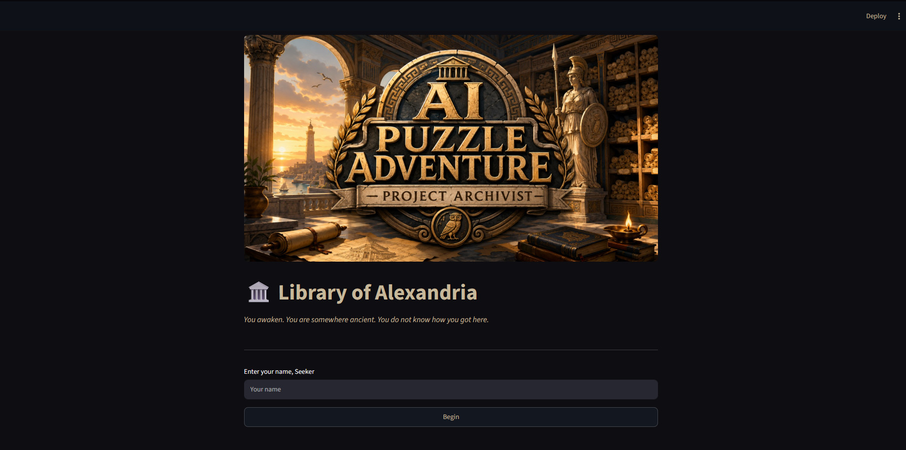
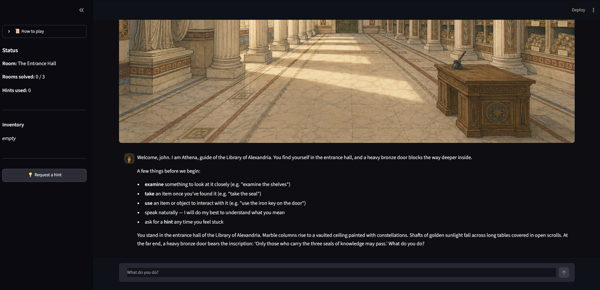

# 🏛️ AI Escape Room — Project Archivist

> A GenAI-powered text adventure. You awaken trapped in the Library of Alexandria and
> must solve three rooms of puzzles to escape. You are guided by Athena, an AI narrator.

The application is **not a chatbot**. An AI layer is wrapped around a deterministic game
engine. The AI understands your free-text input, narrates the world in character, answers
in-world questions from a knowledge base, and judges the final puzzle. Python code is what
keeps the game rules fair and cheat-proof.

---

## Table of contents

- [Concept](#concept)
- [GenAI techniques used](#genai-techniques-used)
- [Tech stack](#tech-stack)
- [Project structure](#project-structure)
- [Prerequisites](#prerequisites)
- [Installation](#installation)
- [Configuration](#configuration)
- [Running the app](#running-the-app)
- [How to play](#how-to-play)
- [API reference](#api-reference)
- [Testing](#testing)
- [Limitations & future work](#limitations--future-work)
- [Puzzle solution (guide)](#puzzle-solution-guide)

---

## Concept

There are three rooms, with a linear path, from one to another, through doors.

1. **The Entrance Hall** — find three hidden *seals of knowledge* and open the bronze door.
2. **The Library** — solve a mystical book's alphanumeric dial to retrieve the iron key.
3. **The Restricted Archives** — answer the lectern's question correctly: *"What are you?"*

As you progress, you will start to notice glitches, system errors and more until the twist is revealed in the ending.
The final goal is to understand your true nature and escape the library.

---

## GenAI techniques used

The AI is used at five distinct points, each where it makes sense:

| Technique | Where | What it does |
|---|---|---|
| **Prompt engineering** | `agent/graph.py` | Instructions for "Athena" personas per room + strict grounding rules so narration never invents facts (hallucinations) |
| **Structured outputs** | `interpret_action` | Forces the model to return a fixed `{action_type, target}` JSON schema (strict mode) |
| **RAG** | `agent/rag.py` + `data/*.md` | FAISS vector store over the game's lore. Answers are grounded in retrieved text |
| **AI agent + tool calling** | `answer_player_question` | A tool-bound LLM decides on its own whether to call the knowledge-base search tool to answer lore-wise questions |
| **LLM-as-judge** | `judge_truth_answer` | Evaluates whether the player's final answer is correct |

---

## Tech stack

- **Backend:** FastAPI, SQLModel (SQLite), Pydantic
- **AI:** LangChain, OpenAI (LLM + embeddings), FAISS (vector store)
- **Frontend:** Streamlit
- **Testing:** pytest

---

## Project structure

```
AI-Escape-Room-Project/
├── backend/
│   └── app/
│       ├── main.py            # FastAPI app: CORS, startup, router wiring
│       ├── models.py          # GameSession DB model (the saved game)
│       ├── game_logic.py      # Deterministic game engine (no AI — the rulebook)
│       ├── agent/
│       │   ├── graph.py        # All LLM calls: parse, narrate, answer, judge, hint
│       │   ├── rag.py          # RAG: builds & queries the FAISS vector store
│       │   └── tools.py        # The knowledge-base tool the agent can call
│       ├── api/
│       │   ├── main.py         # Collects routers
│       │   ├── deps.py         # DB session dependency
│       │   └── routes/game.py  # All /game endpoints
│       ├── core/
│       │   ├── config.py       # Settings loaded from .env
│       │   └── db.py           # Engine + session
│       ├── data/*.md           # Knowledge base (world, rooms, items, puzzles, Athena)
│       └── tests/              # pytest suite (offline)
├── frontend/
│   ├── app.py                  # Streamlit UI (chat, sidebar)
│   └── assets/                 # Optional images (rooms, avatars, title screen)
├── requirements.txt
├── .env.example
└── README.md
```

---

## Prerequisites

- **Python 3.11+**
- An **OpenAI API key** (the app uses the OpenAI API for the LLM and embeddings)

---

## Installation

```bash
# 1. Clone
git clone https://github.com/DenGiannis/AI-Escape-Room-Project.git
cd AI-Escape-Room-Project

# 2. Create and activate a virtual environment
python -m venv .venv
# Windows (PowerShell):
.venv\Scripts\Activate.ps1
# macOS / Linux:
source .venv/bin/activate

# 3. Install dependencies
pip install -r requirements.txt
```

---

## Configuration

Copy the example env file and add your own OpenAI key:

```bash
cp .env.example .env   # Windows: copy .env.example .env
```

Then edit `.env`:

| Variable | Description | Default |
|---|---|---|
| `OPENAI_API_KEY` | Your OpenAI API key (**required**) | — |
| `OPENAI_MODEL` | Chat model to use | eg. `gpt-4o-mini` |

The SQLite database (`escape_room.db`) is created automatically on first run; no manual DB
setup is needed.

---

## Running the app

You need **two terminals**: one for the backend API, one for the Streamlit UI.

**Terminal 1 — backend** (from the `backend/` folder):

```bash
cd backend
uvicorn app.main:app --reload
```

The API runs at **http://localhost:8000**. Interactive Swagger docs are auto-generated at
**http://localhost:8000/docs**.

**Terminal 2 — frontend** (from the project root):

```bash
streamlit run frontend/app.py
```

The UI opens at **http://localhost:8501** and talks to the backend on port 8000. Enter a player 
name, press **Begin**, and play.

---

## How to play

Type what you want to do in natural language and the AI should figure out your intent. 
For better results try to use words as mentioned in table below, but it's not a necessity.

| You type | What happens |
|---|---|
| `look around` | Athena describes the room |
| `examine an object` | Inspect an object (may reveal something) |
| `take the object` | Pick up a discovered item |
| `whisper something` | Solve the drawer riddle in room 1 |
| `dial the code (3 characters)` | Enter a combination in room 2 |
| `who are you?` | Ask an in-world question (triggers the RAG agent) |
| `I am ...` | Answer the final question in room 3 |

Stuck? Click **💡 Request a hint** in the sidebar. (Hints are provided based on your current progress)

`Note:` Try to stick to the gameplay and goal of the game. **Don't** try to use the app as a generic chatbot!

---

## Screenshots
Start Screen:

Gameplay Screen:


Link to gameplay demo video:
[GameplayVideo](screenshots/DemoVideoSpedUp.mp4)

---

## API reference

Base URL: `http://localhost:8000/api/v1`

| Method | Endpoint | Description |
|---|---|---|
| `POST` | `/game/start` | Starts a new game -> returns a `session_id` and the opening scene |
| `POST` | `/game/action` | Send a player action -> returns Athena's narrated response |
| `POST` | `/game/hint` | Request a progress-aware hint for the current room |
| `GET`  | `/game/inventory/{session_id}` | Current inventory and discovered items |
| `GET`  | `/game/summary/{session_id}` | Full session state (room, puzzles solved, etc.) |

**Example — start a game:**

```bash
curl -X POST http://localhost:8000/api/v1/game/start \
  -H "Content-Type: application/json" \
  -d '{"player_name": "Ada"}'
```

**Example — take an action:**

```bash
curl -X POST http://localhost:8000/api/v1/game/action \
  -H "Content-Type: application/json" \
  -d '{"session_id": "<id-from-start>", "input": "examine the shelves"}'
```

Full request/response schemas are browsable at `/docs`.

---

## Testing

An offline test suite (no API key or network needed) covers the deterministic game engine
and the non-AI endpoints:

```bash
cd backend
pytest
```

---

## Limitations & future work

- **Requires an OpenAI API key**, and each action makes LLM calls (small latency + cost).
- **SQLite / single-process** — fine for local play.
- **No authentication** — sessions are identified by an id only.
- **Possible extensions:** 
  1. Add more rooms/puzzles - complicate the puzzles more, add a tutorial area, improve logic
  2. Enrich lore and details about the world and story
  3. Capability to swap LLM providers
  4. Streaming responses 
  5. Add apersistent leaderboard

---

## Puzzle solution (guide)

**Entrance Hall**
- You need to examine three objects
  1. The shelves filled with scrolls.
      - The game will inform you of a scroll with a wax seal.
      - Take this seal
  2. The statue of Athena. Take the seal from her hand.
  3. The scholar's desk.
      - You need to whisper the name "Athena"
      - Once the drawer is open inspect it.
      - Take the seal hidden inside it.
- Use the 3 obtained seals at the bronze door.

**Library**
- Examine the trembling book.
- The riddle is that you have to find the three objects in the room
  and obtain a character from each of them.
  1. Codex (Only one = first character): It mentions the character `U`
  2. Glass cases (Three = second character): `Zero` is mentioned.
  3. Statues (Five = third character): They form the number `Seven`.
- Correct password is: `U07`. Dial it at the book's lock.
- The code can be dialed without finding the objects.
- Take the iron key from inside the book.
- Go and open the silver door.

**Restricted Archives**
- Go and examine the book on the lectern at the centre of the room.
- The answer to the question is: `Robot`, `Machine`, `AI` etc.